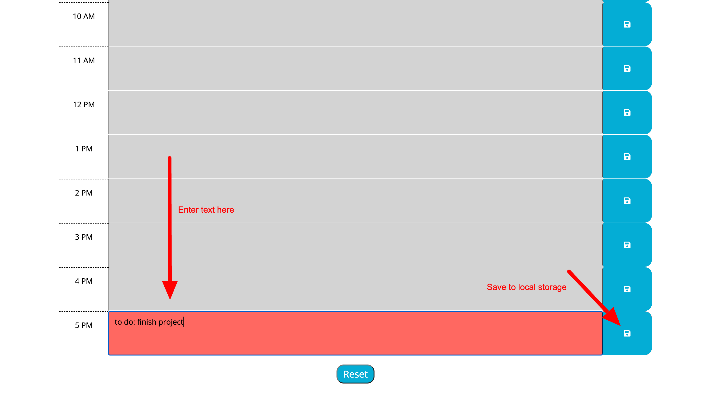
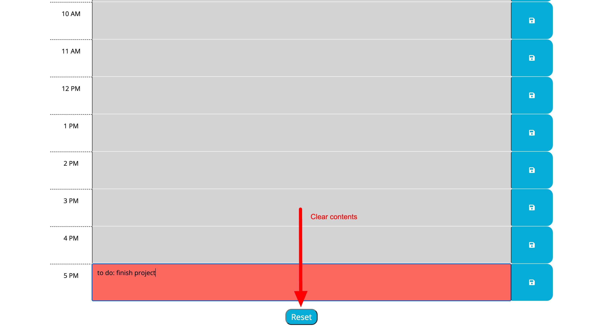
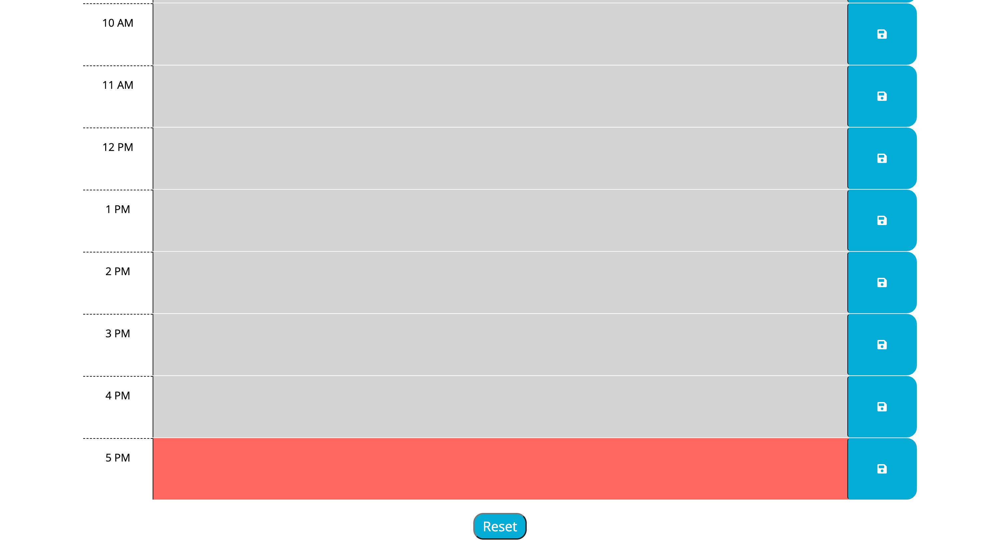

# daily-planner

## Description

A daily planner that tracks tasks hour by hour 9am to 5pm and shows you whats already past, what hour block it is currently and whats left in the rest of the work day

- What was your motivation? Create a daily planner app where you can enter notes hour by hour and save it. 
- Why did you build this project? (Note: the answer is not "Because it was a homework assignment.") to 
- What problem does it solve? allows you to make notes or set appointments in working hours and show you where you are at in the list time wise.
- What did you learn?

## Usage

Provide instructions and examples for use. Include screenshots as needed.

To add a screenshot, create an `assets/images` folder in your repository and upload your screenshot to it. Then, using the relative filepath, add it to your README using the following syntax:

Open application here https://markcurtiss720.github.io/daily-planner/

upon loading you will see blocks of time from 9 am to 5pm
with the current timed block highlighted red, past blocks gray, and not shown here but future blocks highlighted green

you can enter in text and then save it to the local storage.

if you want to clear everything then you press the reset button

and it will clear all content in local storage and reset text fields

## Credits

jQuery attr() Method
https://www.w3schools.com/jquery/html_attr.asp

JavaScript parseInt()
https://www.w3schools.com/jsref/jsref_parseint.asp

## License

Use license on github

## Features

HTML/CSS/JavaScript/JQuery/Bootstrap/dayjs